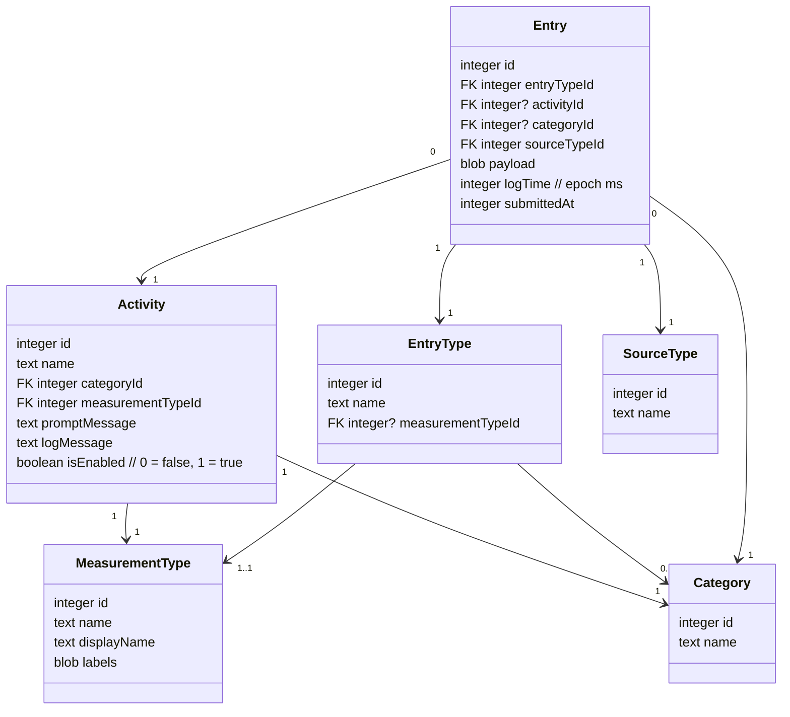

### Data Models



---


## Database Schema

**Core Tables:**

```sql
-- Category (Activity groupings)
CREATE TABLE "Category" (
    "id" INTEGER NOT NULL UNIQUE,
    "name" TEXT NOT NULL UNIQUE, -- Connect, Move, Reflect, Breathe, Nourish, Create, Ground, Structure
    PRIMARY KEY("id" AUTOINCREMENT)
);

-- MeasurementType (How activities are measured)
CREATE TABLE "MeasurementType" (
    "id" INTEGER NOT NULL UNIQUE,
    "name" TEXT NOT NULL UNIQUE, -- yes_no, scale_5, etc.
    "displayName" TEXT,
    "labels" BLOB, -- JSON for scale labels (e.g., "None → The Most")
    PRIMARY KEY("id" AUTOINCREMENT)
);

-- Activity/EntryType (Individual trackable items)
CREATE TABLE "Activity" (
    "id" INTEGER NOT NULL UNIQUE,
    "name" TEXT NOT NULL UNIQUE, -- Food, Emotion, Hydration, Sleep, Symptom, Exercise, custom activities
    "categoryId" INTEGER NOT NULL,
    "prompt" TEXT, -- User prompt/question
    "log" TEXT, -- Logging instructions
    "isEnabled" INTEGER NOT NULL, -- User can toggle in Settings
    "measurementTypeId" INTEGER NOT NULL,
    "isDefault" INTEGER NOT NULL, -- Shipped with app vs user-created
    PRIMARY KEY("id" AUTOINCREMENT),
    FOREIGN KEY("categoryId") REFERENCES "Category"("id"),
    FOREIGN KEY("measurementTypeId") REFERENCES "MeasurementType"("id"),
    CHECK(isEnabled IN (0, 1)),
    CHECK(isDefault IN (0, 1))
);

-- SourceType (How entry was created)
CREATE TABLE "SourceType" (
    "id" INTEGER NOT NULL UNIQUE,
    "name" TEXT NOT NULL UNIQUE, -- log (moment), reflect (end-of-day)
    PRIMARY KEY("id" AUTOINCREMENT)
);

-- Entry/Log (User's logged data)
CREATE TABLE "Entry" (
    "id" INTEGER NOT NULL UNIQUE,
    "activityId" INTEGER NOT NULL,
    "sourceTypeId" INTEGER NOT NULL,
    "timestamp" TEXT NOT NULL, -- ISO datetime (for moment logs) or date (for reflective)
    "value" TEXT NOT NULL, -- JSON: {"rating": 3} or {"response": true}
    "notes" TEXT,
    "foodName" TEXT, -- For food entries (free text)
    "symptomName" TEXT, -- For symptom entries (free text)
    PRIMARY KEY("id" AUTOINCREMENT),
    FOREIGN KEY("activityId") REFERENCES "Activity"("id"),
    FOREIGN KEY("sourceTypeId") REFERENCES "SourceType"("id")
);

-- OverwhelmActivity (Activities for support page)
CREATE TABLE "OverwhelmActivity" (
    "id" INTEGER NOT NULL UNIQUE,
    "title" TEXT NOT NULL,
    "icon" TEXT, -- Optional icon reference
    "effortRating" INTEGER NOT NULL, -- 1-5, user can override
    "userEffortOverride" INTEGER, -- User's custom effort rating
    "isDefault" INTEGER NOT NULL, -- Shipped vs user-created
    "isEnabled" INTEGER NOT NULL,
    PRIMARY KEY("id" AUTOINCREMENT),
    CHECK(effortRating BETWEEN 1 AND 5),
    CHECK(userEffortOverride IS NULL OR userEffortOverride BETWEEN 1 AND 5),
    CHECK(isDefault IN (0, 1)),
    CHECK(isEnabled IN (0, 1))
);
```

**Future Enhancement Tables:**
```sql
-- Tags (For categorization and filtering)
CREATE TABLE "Tag" (
    "id" INTEGER NOT NULL UNIQUE,
    "name" TEXT NOT NULL UNIQUE,
    "type" TEXT NOT NULL, -- food, activity, regulation, happiness, nervous_system
    PRIMARY KEY("id" AUTOINCREMENT)
);

-- Activity Context (For overwhelm support filtering)
CREATE TABLE "ActivityContext" (
    "id" INTEGER NOT NULL UNIQUE,
    "activityId" INTEGER NOT NULL,
    "location" TEXT, -- home, office, public, private
    "duration" INTEGER, -- minutes
    "capacityLevel" TEXT, -- red, yellow, green
    "timeOfDay" TEXT, -- morning, afternoon, evening, any
    PRIMARY KEY("id" AUTOINCREMENT),
    FOREIGN KEY("activityId") REFERENCES "OverwhelmActivity"("id")
);
```